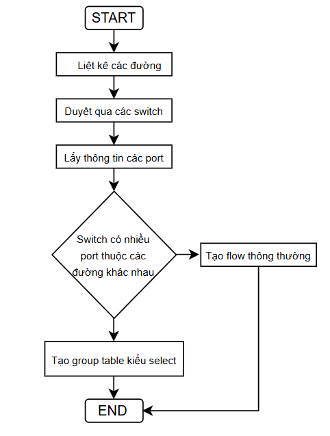
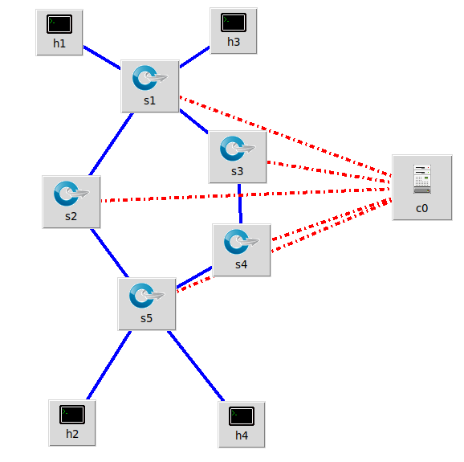
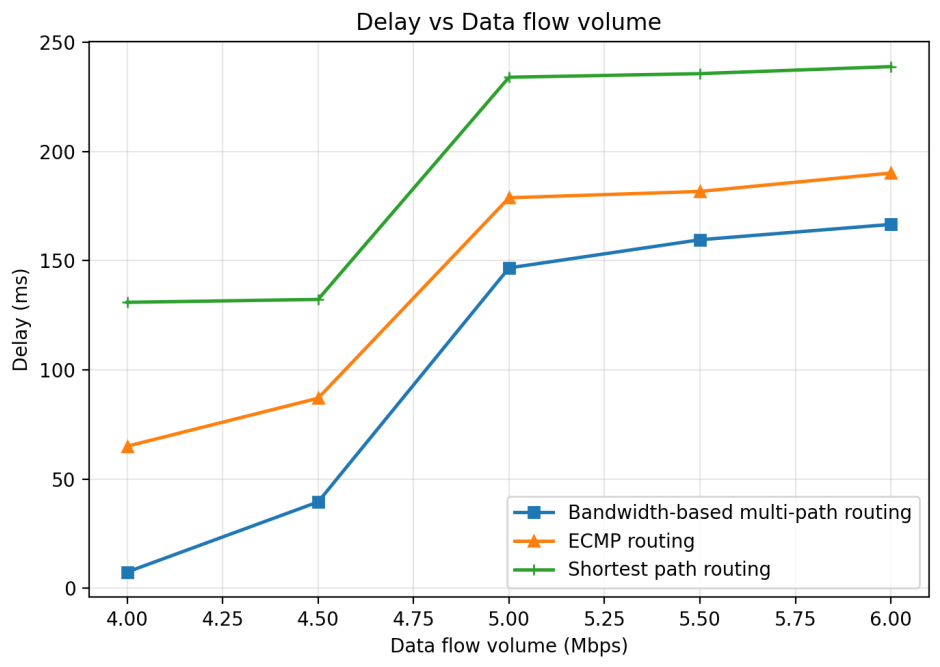
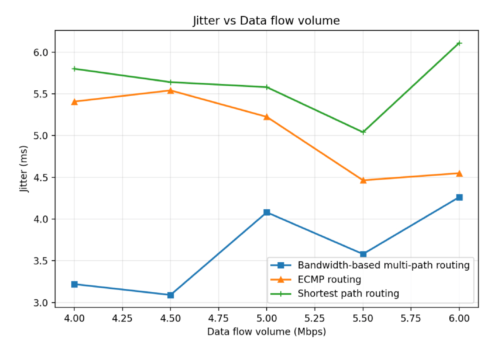
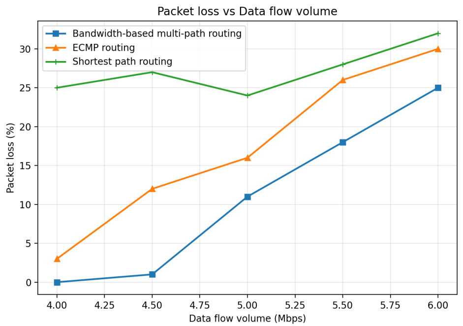

# sdn-multipath-load-balancing

# Adaptive Multipath Load Balancing Based on Available Bandwidth in SDN

## Introduction

This project presents an adaptive multipath load balancing approach in a Software-Defined Networking (SDN) environment.

Traditional routing methods such as Dijkstra shortest-path routing and ECMP (Equal-Cost Multi-Path) forwarding do not consider real-time network congestion conditions. As network traffic increases, these approaches may lead to higher delay, jitter, packet loss, and inefficient bandwidth utilization.

To address these limitations, this project proposes a bandwidth-aware multipath routing algorithm that dynamically selects forwarding paths based on available bandwidth information collected from the network.

The proposed solution is implemented using Ryu Controller, OpenFlow, Mininet, Open vSwitch, and sFlow.

---

# Project Objectives

The main objectives of this project are:

* Implement adaptive multipath routing in an SDN environment
* Monitor real-time network link utilization
* Dynamically avoid congested paths
* Improve network Quality of Service (QoS)
* Evaluate routing performance under different traffic loads

---

# Technologies Used

* Python
* Ryu Controller
* OpenFlow 1.3
* Mininet
* Open vSwitch (OVS)
* sFlow
* iperf
* Ubuntu Linux
* VMware

---

# System Architecture

The project is implemented based on the Software-Defined Networking architecture, where the control plane and data plane are separated.

The Ryu Controller acts as a centralized control plane responsible for:

* Discovering network topology
* Monitoring network status
* Calculating routing paths
* Installing forwarding rules
* Managing multipath load balancing



Open vSwitch devices operate as OpenFlow switches and perform packet forwarding according to flow rules installed by the controller.

Real-time network statistics are collected using sFlow and used to support routing decisions.

---

# Network Topology

The simulation environment consists of two available paths between source and destination hosts.

* Path 1: h1 → s1 → s2 → s5 → h2
* Path 2: h1 → s1 → s3 → s4 → s5 → h2

Background traffic is generated to simulate congestion conditions and evaluate routing performance under increasing network load.

```text
h1 ---- s1 ---- s2 ---- s5 ---- h2
        |              |
        s3 ---- s4 ----
```

Where:

* h1 = Source host
* h2 = Destination host
* s1, s5 = Edge switches
* s2, s3, s4 = Intermediate switches


---

# Routing Algorithm

## 1. Topology Discovery

The Ryu Controller collects topology information and constructs a graph representation of the network.

* Switches are represented as nodes
* Links are represented as edges

This allows the controller to maintain a global view of the network.

---

## 2. Candidate Path Discovery

A Depth-First Search (DFS) algorithm is used to discover all available paths between source and destination hosts.

Instead of relying on a single shortest path, the controller generates multiple candidate paths that can be used for forwarding traffic.

This provides the foundation for adaptive multipath routing.

---

## 3. Real-Time Traffic Monitoring

The controller uses sFlow statistics to monitor link utilization in real time.

Traffic information is collected from switch interfaces to estimate the current bandwidth usage of each network link.

This allows the controller to detect congestion dynamically.

---

## 4. Available Bandwidth Calculation

For each network link, available bandwidth is calculated as:

$$
A = C - U
$$

Where:

* A = Available bandwidth
* C = Link capacity
* U = Current bandwidth utilization

Links with lower available bandwidth are considered more congested.

---

## 5. Dynamic Link Cost Calculation

The cost of each network link is calculated using:

$$
cost_{link} = \frac{B_{ref}}{A}
$$

Where:

* costlink = Link cost
* Bref = Reference bandwidth
* A = Available bandwidth

As available bandwidth decreases, link cost increases.

This allows the controller to avoid congested links automatically.

---

## 6. Path Cost Evaluation

The total cost of a candidate path is calculated as:

$$
cost_{path}(P) = \sum_{e \in P} cost_{link}(e)
$$

Where:

* P = Candidate path
* e = Link belonging to path P

The controller evaluates all candidate paths and selects the paths with lower overall cost.

---

## 7. Multipath Load Balancing

Traffic is distributed across selected paths using OpenFlow Group Table (SELECT type).

Each path is assigned a weight proportional to its available bandwidth:

$$
w_i = \frac{A_i}{\sum_{j=1}^{k} A_j} \times W
$$

Where:

* wi = Weight assigned to path i
* Ai = Available bandwidth of path i
* k = Number of selected paths
* W = Weight scaling factor

Paths with higher available bandwidth receive more traffic, while congested paths receive less traffic.

---

## 8. Flow Rule Installation

The controller dynamically installs:

* Flow entries
* Group table entries
* Bucket weights

into OpenFlow switches.

Traffic forwarding is then handled directly in the data plane.

---

# Performance

The proposed algorithm is evaluated using UDP traffic generated by iperf.

The following QoS metrics are measured:

## Delay

Delay measures the time required for packets to travel from source to destination.



Lower delay indicates better network responsiveness.

## Jitter

Jitter measures the variation in packet delay.



Lower jitter is important for real-time applications such as VoIP and video streaming.

## Packet Loss

Packet loss measures the percentage of packets that fail to reach the destination.



Lower packet loss indicates better transmission reliability.

---

# Experimental Results

Experiments are conducted under increasing traffic load conditions.

The evaluation focuses on observing network performance when traffic approaches or exceeds link capacity.

The proposed routing algorithm demonstrates:

* Reduced network delay
* Reduced jitter
* Lower packet loss
* Better traffic distribution
* Improved bandwidth utilization

These improvements are achieved by dynamically selecting forwarding paths according to current network conditions rather than relying solely on static routing metrics.

---

# Simulation Environment

* Ubuntu Linux running on VMware
* Mininet-based SDN topology
* Open vSwitch with OpenFlow 1.3
* Ryu Controller
* UDP traffic generation using iperf
* Real-time monitoring using sFlow

---

# Conclusion

This project demonstrates an adaptive multipath routing approach for Software-Defined Networking environments.

By combining topology discovery, real-time traffic monitoring, available bandwidth estimation, dynamic path cost calculation, and OpenFlow-based load balancing, the system can distribute traffic more efficiently and respond to congestion conditions dynamically.

The proposed approach provides an effective solution for improving Quality of Service in SDN networks through bandwidth-aware traffic engineering.

---

# Author

Trương Tấn Hòa

Telecommunications and Networking

University of Science – VNU-HCM
